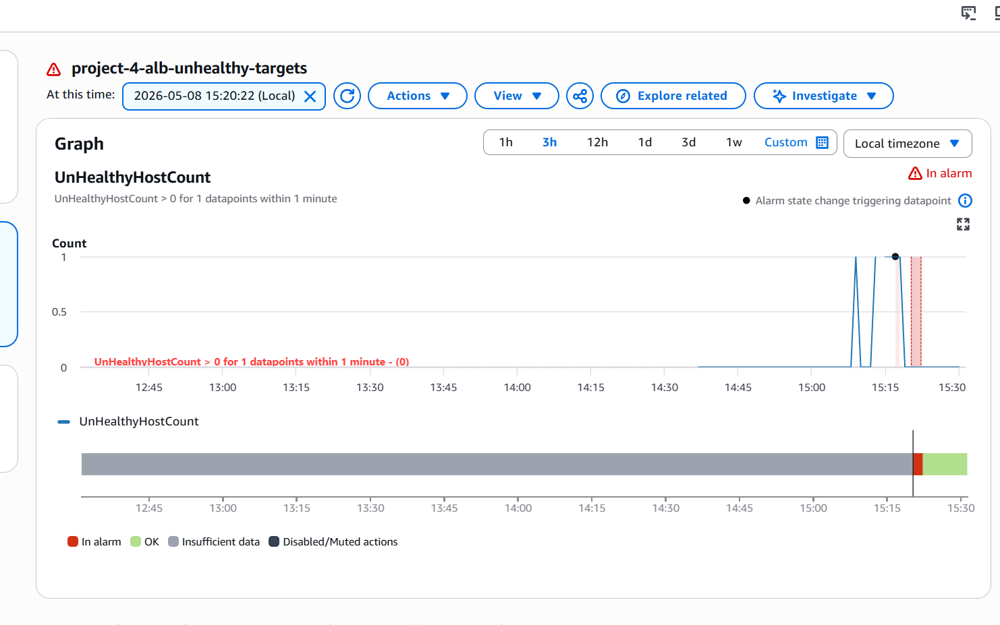
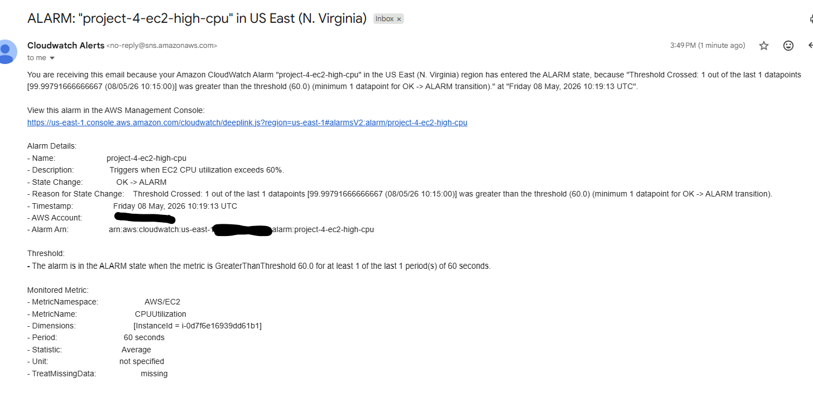
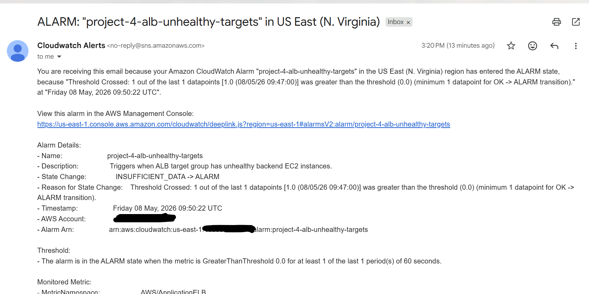
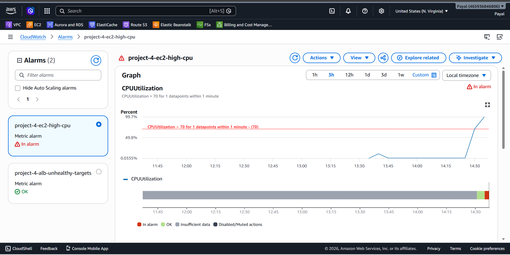
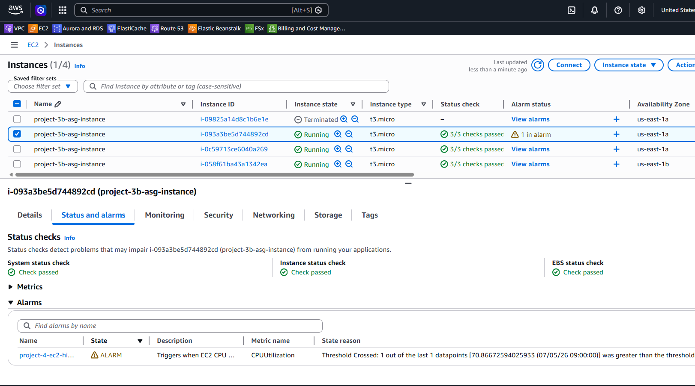
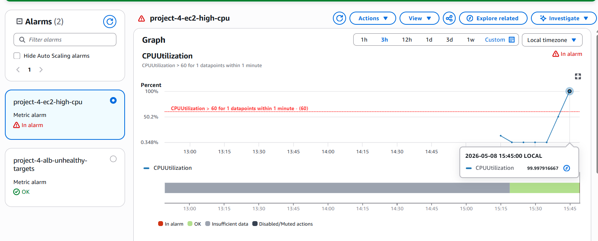

# Project 4 — AWS CloudWatch Monitoring and Alerting

## Overview

This project extends the Dockerized CI/CD AWS deployment by implementing operational monitoring, alerting, and dashboarding using Amazon CloudWatch and Amazon SNS.

The monitoring stack provides visibility into application health, backend target status, EC2 resource utilization, and infrastructure behavior behind the Application Load Balancer and Auto Scaling Group.

CloudWatch alarms were configured to detect unhealthy backend targets and high EC2 CPU utilization. SNS email notifications were integrated to simulate real-world operational alerting workflows.

The project also includes a CloudWatch dashboard to visualize ALB traffic, target health, EC2 performance metrics, and infrastructure status in a centralized monitoring view.

## Monitoring Architecture

```text
Dockerized Application
        ↓
Application Load Balancer
        ↓
CloudWatch Metrics
        ↓
CloudWatch Alarms
        ↓
SNS Notifications
        ↓
Email Alerts
```


---

# Section 3 — Monitored Components

Add:

```markdown id="njlwm5"
## Monitored Components

| Component | Metric | Purpose |
|---|---|---|
| Application Load Balancer | RequestCount | Monitor incoming traffic |
| Target Group | HealthyHostCount | Monitor healthy backend instances |
| Target Group | UnHealthyHostCount | Detect unhealthy targets |
| EC2 Instances | CPUUtilization | Detect high CPU usage |
| Auto Scaling Group | Instance Health | Monitor backend infrastructure |

## CloudWatch Alarms

### 1. ALB Unhealthy Target Alarm
```text
- Alarm Name:project-4-alb-unhealthy-targets
- Purpose:Detects when one or more backend EC2 instances fail ALB health checks.
- Trigger Condition: UnHealthyHostCount > 0
- Action: Sends SNS email notification through the configured alert topic.
```

### 2. EC2 High CPU Alarm
```text
- Alarm Name:project-4-ec2-high-cpu
- Purpose: Detects excessive CPU utilization on backend EC2 instances.
- Trigger Condition: CPUUtilization > 70%
- Action: Sends SNS email notification through the configured alert topic.
```


---

# Section 5 — SNS Integration

Add:

```markdown id="fjlwm7"
## SNS Notification Integration

Amazon SNS was configured to send email alerts when CloudWatch alarms entered the ALARM state.

```text
SNS Topic: project-4-cloudwatch-alerts
Alert Types:
    • Unhealthy backend target detection
    • High EC2 CPU utilization alerts
    • Alarm recovery notifications
```
---

# Section 6 — CloudWatch Dashboard

Add:

```markdown id="8jlwm8"
## CloudWatch Dashboard

A centralized CloudWatch dashboard was created to visualize infrastructure and application health metrics in real time.

Dashboard Widgets:

- ALB Request Count
- Healthy Target Count
- Unhealthy Target Count
- EC2 CPU Utilization
- Target Response Time

The dashboard provides operational visibility into application availability, infrastructure health, and backend performance behavior.
```
## Section 7 - Failure Simulation and Alert Validation

To validate the monitoring configuration, controlled failure simulations were performed.

### Unhealthy Target Simulation

The Docker container was intentionally stopped on one EC2 instance:
```bash
docker stop project-3-web
```
Observed Results:

- ALB health check failed
- Target marked unhealthy
- CloudWatch alarm entered ALARM state
- SNS email alert received
- Dashboard reflected unhealthy target count

Recovery: 
```bash
docker start project-3-web
```
The target recovered successfully and alarms returned to the OK state.

### CPU Stress Test

Artificial CPU load was generated using:
```bash
yes > /dev/null &
```
Observed Results:

- EC2 CPU utilization increased significantly
- CloudWatch CPU alarm triggered
- SNS alert notification received
- Dashboard reflected CPU spike

Recovery:
```bash
pkill yes
```
CPU utilization returned to normal levels and alarms recovered.


---

# Section 8 — Screenshots

Add:
```markdown id="7jlwm0"
## Screenshots

### CloudWatch Dashboard


### ALB Unhealthy Target Alarm



### SNS Email Alert




### CPU Utilization Spike




```

## Section 9 — Skills Demonstrated

- Amazon CloudWatch
- CloudWatch Alarms
- Amazon SNS
- Infrastructure Monitoring
- Application Monitoring
- AWS Observability
- Incident Detection
- Failure Simulation
- Operational Troubleshooting
- EC2 Monitoring
- ALB Health Monitoring
- Dashboarding
- Alerting Workflows

## Section 10 — Lessons Learned

- CloudWatch metrics can be monitored at multiple dimensions including ALB, Target Group, and Availability Zone.
- CloudWatch alarms can proactively detect infrastructure and application failures.
- SNS enables automated operational alerting workflows.
- Health checks play a critical role in load-balanced environments.
- Operational monitoring requires validating alerts through controlled failure simulations.
- CPU stress testing can be used to validate infrastructure monitoring behavior.
- Monitoring and observability are essential components of production-style cloud environments.